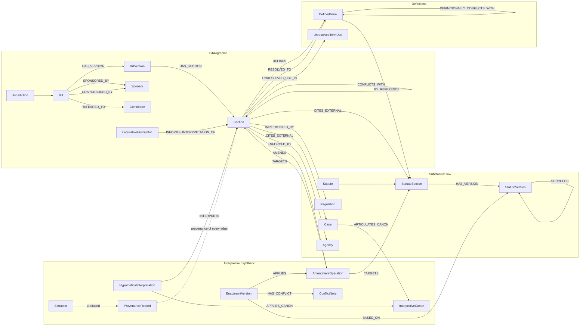

# polilabs schema design — agent-native legislative knowledge graph

**Status:** Draft v0.1 — design phase, pre-implementation.
**Scope:** U.S. federal and (forward-compatibly) state and international legislation, with AI-governance bills as the v1 test corpus.
**Audience:** internal — for review before code is committed against this schema.

---

## 0. Executive summary

We are designing the schema underneath an agent-facing API for legislative research. The product hypothesis is that current legal-AI tools (Westlaw + CoCounsel, Lexis + Lexis AI, lower-stakes wrappers) hallucinate not because LLMs are unreliable in general but because the *substrate* they reason over is hostile to programmatic access. The substrate is editorial, narrative, and built for keyword-search by trained humans. An agent given a Boolean search box and asked to reason about whether bill X conflicts with bill Y will confabulate, and the empirical record bears that out: Magesh et al. (Stanford HAI, 2024) found commercial legal AI products hallucinated in 17%–34% of queries; Dahl et al. ("Large Legal Fictions," 2024) showed near-chance accuracy on doctrinal-agreement tasks. Our wager is that a schema designed for agent traversal can collapse a meaningful fraction of those failures into either correct answers or honest "I don't know" responses.

This document specifies that schema. It is a **property graph** — typed nodes with key/value properties, typed directed edges with edge properties — and it makes several design commitments that the rest of the document defends:

1. **Bitemporal versioning.** Every artifact that changes carries two time axes: when it was true in the legal world and when we recorded that knowledge. Without this, an agent asked "what did the law say in 2022?" will silently substitute the current version.
2. **Definitions are local.** A bill's defined terms are scoped to the smallest enclosing definitional context. There is no global `AI system` node. Use-sites carry explicit `RESOLVED_TO` edges; unresolved use-sites become explicit gap nodes the agent must surface. This is the single biggest hallucination guardrail in the schema.
3. **Hard edges and soft edges are mixed in the same graph, separated by a first-class `derivation` property.** Mechanically-derivable edges (`AMENDS`, `COSPONSORS`, `CODIFIED_AT`) live next to LLM-inferred ones (`CONFLICTS_WITH`, `IMPLEMENTED_BY`) but carry derivation, confidence, and full provenance — so an agent can choose its risk tolerance.
4. **Amendments are reified.** An amendment is not an edge label; it is a typed node with operation, target locator, before/after text, and provenance. Synthesizing an `EnactmentVersion` ("if this bill passes, here is what the statute would read") is a deterministic walk over a chain of amendment nodes, with explicit `ConflictNote` nodes when two amendments collide.
5. **Interpretive reasoning is reified too.** An interpretive claim ("under *ejusdem generis* the catch-all in §4 reaches X but not Y") is a `HypotheticalInterpretation` node connecting a `Section`, an `InterpretiveCanon`, a methodology, an outcome, an author, and a confidence. It is never a direct edge between section and canon, because interpretive claims are contestable and we need attribution.

Sections 1–9 below specify each of these in detail with concrete examples drawn from bills in the polilabs v1 corpus (`~/polilabs/data/corpus/legislation/`).

---

## 1. Entity types

The ontology has 23 node types, organized into four families. Each entity below lists required (R) and optional (O) properties, the identifier scheme, the versioning posture, the alternative considered, and why the alternative was rejected.

### 1.1 Bibliographic family

These describe the legislative artifact-as-document, regardless of its substantive content.

#### `Jurisdiction`
The legal sovereign whose process produced an artifact. Required so that "Section 552 of title 5" disambiguates between federal U.S. Code and Texas Government Code §552, both of which exist.
- **Properties:** R `urn` (`us`, `us-ca`, `us-tx`, `eu`), R `name`, R `legal_system ∈ {common_law, civil_law, mixed}`, O `parent_jurisdiction` (e.g., `us-ca` → `us`).
- **ID scheme:** ISO 3166-2-like URN (`us`, `us-ca`).
- **Versioning:** essentially atemporal at our resolution; if a sovereign reorganizes, mint a new node.
- **Alternative considered:** treat jurisdiction as a free-text property on Bill. Rejected because cross-jurisdictional definitional conflict queries (EU AI Act vs. U.S. federal vs. California SB 1047 on "AI system") require joining over jurisdiction; a free-text property makes those joins fragile.

#### `Bill`
The bibliographic record — the *concept* of "H.R. 1736, 119th Congress" independent of any one snapshot of its text.
- **Properties:** R `congress` (or `session` for non-federal), R `bill_type` (`hr`, `s`, `hjres`, etc.), R `bill_number`, R `jurisdiction_urn`, O `short_title`, O `official_title`, O `primary_subject`, R `current_status` (`introduced`, `engrossed`, `enrolled`, `public_law`, `vetoed`, `died`).
- **ID scheme:** `bill:us/119/hr/1736`.
- **Versioning:** the Bill node itself is *atemporal* — it is the bibliographic identity. The text snapshots live in `BillVersion`.
- **Alternative considered:** merge Bill and BillVersion. Rejected because legislative-history queries ("how did the text change from Introduced to Engrossed?") require a stable parent to attach a sequence of versions to.

#### `BillVersion`
A specific text snapshot at a procedural stage — introduced, engrossed-in-house, engrossed-in-senate, enrolled, public law. The corpus stores exactly these stages.
- **Properties:** R `stage`, R `version_observed_at` (the date the text existed in this form), R `knowledge_recorded_at` (when polilabs ingested), R `xml_format ∈ {uslm, pre-uslm}`, R `source_package_id` (GovInfo package), O `parent_bill_id`.
- **ID scheme:** `bill:us/119/hr/1736@2025-11-19/engrossed-house` — opaque short hash also retained for graph storage.
- **Versioning:** this *is* the versioned node. Each procedural stage gets a new BillVersion; the Bill node points at all of them via `HAS_VERSION` edges.
- **Alternative considered:** track only the latest version. Rejected because amendatory analysis often needs the Introduced version (to compare against committee-modified text); FOIA-style queries about the deliberative process need the full chain.

#### `Section`
A container in a BillVersion's body — a section, subsection, paragraph, subparagraph, clause, or subclause. Flattened into one node type with a `level` property rather than five node types, because USLM allows arbitrary nesting and the section-walking algorithms (citation resolution, definition scoping, amendment targeting) all work the same way on every level.
- **Properties:** R `bill_version_id`, R `level ∈ {division, title, subtitle, part, subpart, chapter, subchapter, section, subsection, paragraph, subparagraph, clause, subclause, item, subitem}`, O `enum` (`1`, `a`, `2`, `i`), O `heading`, R `text_self` (verbatim direct content), R `text_full` (recursive), R `canonical_citation` (`Sec. 3(c)(2) of H.R. 1736, 119th Cong.`), R `parent_section_id` (nullable), R `ordinal` (sibling order), R `xml_id` (USLM `id` attribute, for round-trip stability).
- **ID scheme:** `bill:us/119/hr/1736@2025-11-19/engrossed-house#sec=3,subsec=c,para=2` plus an opaque short hash.
- **Versioning:** Sections inherit their version from BillVersion; they do not version independently.
- **⚠️ Hallucination risk:** A naive extractor will collapse hierarchy levels — emitting `(a)` from one bill and `(a)` from another as the "same" section. Verification: the `xml_id` from USLM is globally unique within a bill version and provides round-trip stability; resolvers must check it, not the enum alone.
- **Alternative considered:** five separate node types (Section, Subsection, Paragraph, Subparagraph, Clause). Rejected; doubles the schema surface for no expressive gain and prevents writing one `walk_descendants` traversal.

#### `Sponsor` / `Legislator`
A legislator who can sponsor or cosponsor a bill. Long-lived independent identity (a legislator's career spans congresses).
- **Properties:** R `bioguide_id` (Library of Congress unique ID), R `name`, R `party_history` (list of `{party, from, to}`), R `chamber_history`, O `state`, O `district`.
- **ID scheme:** `person:bioguide/S001150` (Schiff's bioguide ID, used in `119-hr-1736`'s `<sponsor name-id="S001150">` markup).
- **Versioning:** the person is stable; party and chamber history is time-ranged inside the node rather than via versioned nodes (party-switch events are rare enough that explicit time ranges suffice).
- **Alternative considered:** key on free-text name. Rejected — name collisions (multiple Smiths in one Congress) are common.

#### `Committee`
A legislative committee that may receive a bill referral.
- **Properties:** R `congress`, R `chamber`, R `committee_code` (Library of Congress code, e.g., `HJU00` for House Judiciary), R `name`, O `parent_committee` (for subcommittees).
- **ID scheme:** `committee:us/119/house/judiciary` plus the Library of Congress committee code.
- **Versioning:** scoped to a single Congress because committee jurisdiction is reorganized between Congresses; a Committee in the 118th is technically a different node from a Committee with the same name in the 119th.

#### `LegislativeHistoryDocument`
Committee reports, floor statements, conference reports, hearings, signing statements — the artifacts a court might consult under a purposivist or intentionalist methodology.
- **Properties:** R `document_type ∈ {committee_report, floor_statement, conference_report, hearing_transcript, signing_statement, agency_comment}`, R `bill_id` it pertains to (nullable for general policy hearings), R `date`, R `chamber_or_committee`, R `source_url`, O `interpretive_weight ∈ {high, medium, low, contested}` (which we will *not* try to set programmatically — see §5).
- **ID scheme:** stable hash of source URL + document type.
- **Versioning:** atemporal; documents are fixed once published.

### 1.2 Substantive-law family

These describe the legal landscape the bills act upon.

#### `Statute`
A codified law as a continuing entity — e.g., FOIA (5 U.S.C. §552). This is the *concept*; point-in-time text lives in `StatuteVersion`.
- **Properties:** R `code` (`usc`, `cfr`, `ca-bpc`), R `title`, R `section`, O `popular_name` ("Freedom of Information Act").
- **ID scheme:** `statute:us/usc/5/552`.
- **Versioning:** atemporal at the Statute level; text snapshots live in StatuteVersion.
- **Alternative considered:** flatten StatuteSection into Statute. Rejected — sub-section structure (e.g., 5 U.S.C. §552(a)(1)(B)) is the granularity at which amendments target text.

#### `StatuteSection`
A specific subdivision of a codified law, the unit that amendments and citations actually target.
- **Properties:** R `statute_id`, R `enum_path` (e.g., `a.1.B`), R `canonical_citation` (`5 U.S.C. §552(a)(1)(B)`).
- **ID scheme:** `statute:us/usc/5/552/a/1/B`.

#### `StatuteVersion`
The text of a statute (or statute section) as of a specific date.
- **Properties:** R `statute_or_section_id`, R `text`, R `in_force_from`, O `in_force_to`, R `source` (OLRC release point ID, e.g., `release-point-118-78`), R `version_observed_at`, R `knowledge_recorded_at`.
- **ID scheme:** `statute:us/usc/5/552@2024-09-01`.
- **Versioning:** bitemporal. `in_force_*` is the legal time axis (when the text was law); `knowledge_recorded_at` is the ingestion time axis (so we can answer "what did we *believe* the law to be at the time we wrote that brief?").
- **⚠️ Hallucination risk:** An agent asked "what does FOIA say?" will pick whatever version is closest in its training data unless point-in-time queries are mandatory. Verification: API must require `as_of` for any StatuteVersion read; calling without it must return the current version with a provenance note that *names* the version date — never silently.
- **Alternative considered:** store statutes as immutable text blobs and patch with amendments at query time. Rejected — OLRC release points already give us point-in-time snapshots at quarter resolution; storing the materialized text is faster and is the source of truth for our `EnactmentVersion` synthesizer to compare against.

#### `Regulation`, `RegulationSection`, `RegulationVersion`
Same shape as Statute family but sourced from Federal Register / CFR rather than USC. Deferred to post-v1 ingestion but the schema supports them now so that `IMPLEMENTED_BY` edges from bill sections to regs are well-typed.

#### `Case`
A judicial opinion that interprets a statute or articulates a canon.
- **Properties:** R `citation` (`410 U.S. 113`), R `court`, R `decision_date`, R `parties`, R `holdings` (text), O `judges`, O `methodology_tags` (whether the opinion was decided on textualist, purposivist, etc. grounds — explicitly *not* auto-derived; either human-annotated or NLP-extracted with high uncertainty).
- **ID scheme:** stable hash of citation + court.

#### `Agency`
A federal or state agency designated as the enforcer or implementer of a provision.
- **Properties:** R `name`, R `jurisdiction_urn`, R `agency_type ∈ {executive, independent, legislative}`, O `parent_agency`.
- **ID scheme:** `agency:us/dhs`, `agency:us/ftc`. Example from `119-hr-1736 §3(a)(1)`: "the Secretary of Homeland Security, in consultation with the Director of National Intelligence" → two `Agency` nodes referenced via `DESIGNATES_AGENCY` edges with role properties.

### 1.3 Definitional family

The most hallucination-critical part of the schema.

#### `DefinedTerm`
A term defined explicitly in a specific bill, statute, or regulation, with a specific scope.
- **Properties:** R `surface_form` (`artificial intelligence`), R `defining_section_id` (the Section/StatuteSection node that defines it), R `scope ∈ {bill_local, section_local, title_local, statute_global, jurisdiction_global}`, R `definition_text` (verbatim), R `definition_type ∈ {direct, by_reference, hybrid}`, O `by_reference_target_id` (when `definition_type = by_reference`).
- **ID scheme:** `term:bill:us/119/hr/1736@2025-11-19/engrossed-house#sec=3,subsec=c,para=3::generative_artificial_intelligence`.
- **Versioning:** scoped to the BillVersion; a new BillVersion with edited definitions mints new DefinedTerm nodes.
- **Worked example:** `119-hr-1736 §3(c)` contains *eight* DefinedTerm nodes, *six* of which are `definition_type = by_reference` (e.g., "artificial intelligence" → `15 U.S.C. §9401`; "terrorism" → `6 U.S.C. §101`; "intelligence community" → `50 U.S.C. §3003(4)`) and *two* of which are `direct` ("generative artificial intelligence", "National Network of Fusion Centers"). Contrast with `118-hr-7913 §2(d)(4)`: "Generative AI system" is defined *directly* as a software product or service that "(A) substantially incorporates one or more generative AI models; AND (B) is designed for use by consumers." The "designed for use by consumers" prong is a definitional carve-out that excludes B2B AI services entirely — an agent that conflates this with the broader sense in `118-hr-6881 §3(m)(4)` ("foundation model" with no consumer-facing requirement, parameter count ≥ 1B) will produce confidently wrong cross-bill analysis.
- **⚠️ Hallucination risk:** This is the largest. A naive LLM asked "does H.R. 7913 cover GitHub Copilot?" will reason about copilot from training-data priors about "generative AI" generally, not from the specific consumer-facing definition in §2(d)(4). Verification: the schema *requires* every appearance of a defined term in body text to carry a `RESOLVED_TO` edge to a specific DefinedTerm node. The resolver fails closed — unresolved use-sites mint `UnresolvedTermUse` nodes that the agent API surfaces as gaps.

#### `UnresolvedTermUse`
A use of what looks like a defined term in a section, where the extractor cannot identify which DefinedTerm it points to.
- **Properties:** R `section_id`, R `surface_form`, R `candidates` (list of `(defined_term_id, confidence)`), R `reason` (`ambiguous_scope`, `no_matching_definition`, `extraction_uncertainty`).
- **ID scheme:** synthetic stable hash of `(section_id, char_offset, surface_form)`.
- **Purpose:** *negative information*. The schema treats absence of resolution as a first-class fact, not a missing edge. The agent API exposes these explicitly: "in §4(b), the phrase 'high-risk AI system' is used but no scoped definition is found — the surface match candidates are X, Y, Z; please clarify."

### 1.4 Interpretive and synthetic family

These do not correspond to any single artifact in the source XML; they are constructions our pipeline materializes.

#### `InterpretiveCanon`
A canonical interpretive principle.
- **Properties:** R `name` (`ejusdem_generis`, `expressio_unius`, `noscitur_a_sociis`, `in_pari_materia`, `rule_against_surplusage`, `rule_of_lenity`, `constitutional_avoidance`, `chevron_deference` (now reduced post-*Loper Bright*), `major_questions_doctrine`), R `formulation` (the canon stated in canonical form), R `school ∈ {textualist, purposivist, intentionalist, dynamic, structural}`, R `articulating_cases` (list of Case IDs), O `current_doctrinal_status ∈ {settled, contested, recently_modified, abrogated}`.
- **ID scheme:** `canon:ejusdem_generis`.
- **Versioning:** version when the doctrinal status changes (e.g., `chevron_deference` should have one node for the 1984–2024 form and another for the post-*Loper Bright* status).

#### `HypotheticalInterpretation`
A reified node representing the *claim* that a particular canon, applied to a particular section, yields a particular outcome.
- **Properties:** R `section_id`, R `canon_id`, R `methodology ∈ {textualist, purposivist, intentionalist, dynamic, original_public_meaning}`, R `outcome` (free text), R `confidence`, R `author ∈ {polilabs_extractor_v1, human_expert, agent_assertion}`, R `provenance_record_id`.
- **Purpose:** an interpretive claim is contestable. The schema models it as a *node* attached to a section, not as an edge property, so two analysts can disagree without overwriting each other and an agent can show "three textualist interpretations and one purposivist."
- **⚠️ Hallucination risk:** if interpretive claims were direct edges with a "canon" property, an LLM could create one mid-query and have it indistinguishable from a curated one. Verification: every HypotheticalInterpretation must carry an `author` and `provenance_record_id`; the agent API surfaces author when reporting.

#### `EnactmentVersion`
The synthesized text of a statute as it would read *if* a specific set of amendments were enacted. The agent uses this to answer "if H.R. 1234 passes, what does 5 U.S.C. §552 say?"
- **Properties:** R `base_statute_version_id`, R `applied_amendments` (ordered list of AmendmentOperation IDs), R `resulting_text`, R `conflicts_unresolved` (list of `ConflictNote` IDs), R `synthesis_method ∈ {deterministic_replay, manual_reconciliation}`, R `synthesized_at`.
- **ID scheme:** content-addressed — hash of `(base_id, sorted_amendment_ids)`. This makes EnactmentVersion *idempotent*: the same set of amendments always yields the same node.
- See §4.

#### `AmendmentOperation`
A reified amendment as a node, not an edge. See §4.

#### `ConflictNote`
A reified conflict marker, attached to an EnactmentVersion or to a pair of bills.
- **Properties:** R `conflict_type ∈ {amendment_collision, definitional_disagreement, enforcement_duplication, jurisdictional_overlap}`, R `parties` (list of node IDs), R `description`, R `confidence`, R `provenance_record_id`.

#### `ProvenanceRecord`
Every derived node and edge points to one. See §6.

#### `Extractor`
The specific code/model that produced a given derived edge.
- **Properties:** R `extractor_id` (`uslm_amendment_parser_v0.3`, `llm_definition_extractor_claude-opus-4-7_2026-05`), R `version`, R `kind ∈ {regex, parser, classifier, llm}`, R `model_card_url`, O `prompt_template_hash`, O `evaluator_results` (link to an Eval node tracking this extractor's measured accuracy on a held-out set).

---

## 2. Relationship types

Twenty-one edge types. For each: directionality, cardinality, properties, derivation default, and the alternative considered.

A universal convention: every edge has `derivation`, `confidence`, and `provenance_record_id` properties unless explicitly noted as `derivation: mechanical` (in which case confidence defaults to 1.0 and the provenance record points to the bill XML offset).

### 2.1 Hard edges (mechanically derivable from source XML)

| Edge | Source → Target | Cardinality | Edge properties |
|---|---|---|---|
| `HAS_VERSION` | Bill → BillVersion | 1..N | `stage`, `is_current` |
| `HAS_SECTION` | BillVersion → Section | 1..N | `ordinal` |
| `PARENT_OF` | Section → Section | 1..N | `ordinal` |
| `SPONSORED_BY` | Bill → Sponsor | 1 | `date` |
| `COSPONSORED_BY` | Bill → Sponsor | 0..N | `date`, `withdrew_on` |
| `REFERRED_TO` | Bill → Committee | 0..N | `date`, `chamber` |
| `DEFINES` | Section → DefinedTerm | 0..N | `definition_type` |
| `CITES_EXTERNAL` | Section → StatuteSection / Case / Regulation | 0..N | `raw_text`, `xml_ref_id` |
| `CITES_INTERNAL` | Section → Section (same BillVersion) | 0..N | `raw_text`, `xml_ref_id` |
| `CODIFIED_AT` | Section → StatuteSection | 0..1 | (set only when bill enacts new code) |
| `SUCCEEDS` | StatuteVersion → StatuteVersion | 1 | `effective_date_of_change` |

USLM's `<external-xref legal-doc="usc" parsable-cite="usc/15/9401">15 U.S.C. 9401</external-xref>` element gives us `CITES_EXTERNAL` edges *mechanically*. `119-hr-1736` alone contains six such edges in §3(c). For the 188 pre-USLM bills in the corpus we fall back to regex + the patterns in §6.

### 2.2 Amendatory edges (mechanically derivable, but with reified operation node)

| Edge | Source → Target | Cardinality | Properties |
|---|---|---|---|
| `AMENDS` | Section → AmendmentOperation | 0..N | `xml_ref_id` |
| `TARGETS` | AmendmentOperation → StatuteSection / Section | 1 | `enum_path_in_target` |

See §4 for why amendments are reified.

### 2.3 Definitional edges

| Edge | Source → Target | Cardinality | Properties |
|---|---|---|---|
| `RESOLVED_TO` | Section (use-site) → DefinedTerm | 0..N | `char_offset`, `confidence`, `derivation` |
| `UNRESOLVED_USE_IN` | UnresolvedTermUse → Section | 1 | `surface_form` |
| `BY_REFERENCE` | DefinedTerm → DefinedTerm / StatuteSection | 0..1 | (set when `definition_type = by_reference`) |
| `DEFINITIONALLY_CONFLICTS_WITH` | DefinedTerm → DefinedTerm | 0..N | `axes_of_disagreement` (list), `confidence`, `derivation` |

See §3.

### 2.4 Interpretive edges

| Edge | Source → Target | Cardinality | Properties |
|---|---|---|---|
| `INTERPRETS` | HypotheticalInterpretation → Section | 1 | — |
| `APPLIES_CANON` | HypotheticalInterpretation → InterpretiveCanon | 1..N | — |
| `ARTICULATES_CANON` | Case → InterpretiveCanon | 0..N | `pin_cite`, `weight` |
| `INFORMS_INTERPRETATION_OF` | LegislativeHistoryDocument → Section | 0..N | `confidence`, `interpretive_school` |

### 2.5 Soft edges (require NLP/LLM extraction with verification)

| Edge | Source → Target | Cardinality | Properties |
|---|---|---|---|
| `CONFLICTS_WITH` | Bill ↔ Bill / Section ↔ Section | 0..N | `axes`, `confidence`, `derivation` (must be `llm_inferred` or `human_annotated`) |
| `IMPLEMENTED_BY` | Section → Regulation | 0..N | `confidence`, `derivation` |
| `ENFORCED_BY` | Section / Statute → Agency | 0..N | `role ∈ {primary_enforcer, consulting, oversight}`, `derivation` |
| `MOTIVATED_BY` | Section → Case / Event | 0..N | `confidence` (the *purpose* a drafter had in mind — extremely soft) |
| `SUPERSEDES_INTERPRETIVELY` | Section → Section | 0..N | (one provision implicitly supersedes another without an explicit amendment — soft) |

**Cardinality note:** edges are multi-edges throughout. Two bills can `CONFLICTS_WITH` each other along multiple `axes` (definitional, enforcement, jurisdictional); each axis is its own edge instance so the agent can ask "show me all definitional conflicts."

**⚠️ Hallucination risk on `CONFLICTS_WITH`:** This is the soft edge most prone to confident-wrong outputs. An LLM asked "does H.R. 7913 conflict with H.R. 6881?" will reason from headline framing ("they're both AI bills, so probably yes") rather than from the actual definitional incompatibility (different scoping of "AI system"). Verification: every `CONFLICTS_WITH` edge requires a `derivation: llm_inferred` and a confidence below 0.7 is suppressed from default API responses; the agent must explicitly request `include_soft_edges=True` to see them, and every such edge carries the prompt template hash so we can reproduce.

---

## 3. The definitions subsystem

This is the section the entire schema is engineered around. If we get this wrong, the rest is decoration.

### 3.1 Scoping rules

A `DefinedTerm` is scoped to the smallest enclosing definitional context that the bill itself signals. The signal hierarchy:

1. **Section-local** — the definitions appear inside a single section (most common pattern). `119-hr-1736 §3(c)` defines its terms "In this section:" — these terms apply only within §3. If the same bill had a §4, the §3(c) definitions would *not* extend to §4 unless §4 said so. Scope: `section_local`.
2. **Title-local** — definitions appear in a title-introducing section that says "In this title:" — common in omnibus bills.
3. **Bill-local** — definitions appear in a "Definitions" section that says "In this Act:" — common in standalone bills. `118-hr-6881 §3(m)` defines its terms "In this section:", but §3 is the only substantive section, so practically the scope is the entire bill. The schema still records `section_local` (because the bill said so) but a query rewriter can widen if the bill has only one substantive section.
4. **Statute-global** — when a bill amends an existing statute to add a definition, the scope becomes the statute or statute title (depending on what's amended).
5. **Jurisdiction-global** — extremely rare, only when a definition is added to a general-purpose definitions title (e.g., 1 U.S.C. §1 "Dictionary Act").

A use-site in §4 of a bill whose definitions are in §3(c) ("In this section") therefore *does not resolve* to a §3(c) DefinedTerm — it becomes an UnresolvedTermUse. The agent API surfaces this as: "the phrase 'generative artificial intelligence' appears in §4(b), but the only matching DefinedTerm is scoped to §3 and does not extend to §4. Three plausible resolutions exist; please clarify."

**Alternative considered:** scope every DefinedTerm to the entire bill by default. Rejected — bills frequently use the same term with different meanings in different titles (NDAA-style bills are notorious). Defaulting to bill-wide would silently merge those.

### 3.2 Resolution algorithm

Given a use-site `(section_id, surface_form, char_offset)`, the resolver:

1. Walks *up* the section hierarchy from the use-site, collecting all DefinedTerm nodes with `defining_section_id` that is an ancestor and whose `scope` includes the use-site's level.
2. Filters to surface-form matches (with normalization: case, plural, hyphenation).
3. If exactly one candidate remains, mints a `RESOLVED_TO` edge with `derivation: mechanical` and `confidence: 1.0`.
4. If zero candidates remain, mints an `UnresolvedTermUse` node with `reason: no_matching_definition` and a list of *cross-bill* candidates (other bills' DefinedTerms with matching surface form), each scored by jurisdictional and topical proximity.
5. If multiple candidates remain, mints an `UnresolvedTermUse` with `reason: ambiguous_scope` and the candidates.
6. **Never falls back to the LLM's prior meaning.** This is the constitutional rule. An agent that cannot resolve a defined term must report the gap rather than confabulate.

### 3.3 Cross-bill conflict representation

A `DEFINITIONALLY_CONFLICTS_WITH` edge connects two DefinedTerm nodes when they share a surface form and either:
- Their definition texts diverge on a measurable axis (presence/absence of a clause, threshold parameters, scope of inclusion/exclusion), or
- A human or LLM judges them substantively in conflict.

Edge properties: `axes_of_disagreement` (`scope`, `threshold`, `inclusion_carve_out`, `enforcement_target`), `confidence`, `derivation`.

**Concrete example.** Three definitions of AI/foundation/generative AI in the corpus, all using overlapping surface forms:

| Bill | DefinedTerm | Definition core | Critical disagreement |
|---|---|---|---|
| `119-hr-1736 §3(c)(2)` | "artificial intelligence" | by-reference to 15 U.S.C. 9401 | Inherits the breadth of 9401 (very broad) |
| `118-hr-7913 §2(d)(4)` | "generative AI system" | software product/service that "substantially incorporates one or more generative AI models; AND is designed for use by consumers" | Consumer-facing carve-out *excludes B2B* |
| `118-hr-6881 §3(m)(4)` | "foundation model" | AI model trained on broad data, ≥ 1B parameters, applicable across wide range of contexts, with high-risk capabilities | Quantitative threshold (1B params) + qualitative risk gate |

A correctly-built graph has `DEFINITIONALLY_CONFLICTS_WITH` edges between these three nodes along `axes = [scope, threshold, inclusion_carve_out]`. The query "all active bills defining 'AI system' to include open-source models" then becomes: filter DefinedTerm nodes with surface form ∈ {artificial intelligence, AI system, foundation model, generative AI system} where the `definition_text` does not contain an open-source exclusion. The agent does *not* paraphrase the definitions to make this judgment — the schema requires the analysis to be either a structured filter or a `HypotheticalInterpretation` node with explicit author.

---

## 4. The amendment and enactment subsystem

Most substantive provisions in legislation modify other documents rather than creating new ones. The standard form is:

> "Section 552(a)(1)(B) of title 5, United States Code, is amended by striking '...' and inserting '...'."

The polilabs schema represents each such modification as a reified `AmendmentOperation` node so that the bill's *semantic intent* (after the amendment, what does §552(a)(1)(B) read like?) is computable, not narrative.

### 4.1 The `AmendmentOperation` reified node

- **Properties:** R `source_section_id` (the bill section issuing the amendment), R `operation_type ∈ {strike, insert, replace, redesignate, repeal, add_at_end, strike_and_insert}`, R `target_locator` (a path into the target document — see §4.2), R `before_text` (verbatim quoted in the bill, when the operation requires it), R `after_text` (verbatim quoted), R `effective_date` (may be conditional), R `provenance_record_id`.
- **ID scheme:** content-addressed hash of `(source_section_id, target_locator, operation_type)`.

The `AMENDS` edge points from the bill Section to the AmendmentOperation, and `TARGETS` points from AmendmentOperation to the StatuteSection (or BillSection, for self-amending bills). This lets us query:

- All AmendmentOperations targeting `5 U.S.C. §552(a)`: `MATCH (op:AmendmentOperation)-[:TARGETS]->(s:StatuteSection {enum_path: 'a'}) RETURN op`.

**Alternative considered:** model amendments as a single `AMENDS` edge with a JSON blob property. Rejected — losing query-ability on operation type and target enum kills the "all bills amending the same statute" use case.

### 4.2 The target locator

Amendments target a sub-tree of an existing document. The locator is a structured path:

```
{
  "document_type": "usc",
  "title": 5,
  "section": 552,
  "subdivisions": [{"level": "subsection", "enum": "a"},
                   {"level": "paragraph", "enum": "1"},
                   {"level": "subparagraph", "enum": "B"}]
}
```

Drafters sometimes write ambiguous locators ("the third sentence of subsection (b)"), in which case the parser emits a `LocatorAmbiguity` flag on the AmendmentOperation and an `UnresolvedTermUse`-style note on the target.

**⚠️ Hallucination risk:** An LLM-driven amendment parser will *invent* before-text when the bill text doesn't quote it cleanly. Verification: the AmendmentOperation's `before_text` must be a verbatim substring of the *target StatuteVersion* current at the bill's introduction date; the synthesizer (§4.3) rejects any operation where this verification fails, and surfaces a `ConflictNote` on the resulting EnactmentVersion.

### 4.3 `EnactmentVersion` synthesis

Synthesis is a deterministic replay:

1. Start from a chosen `base_statute_version_id` (typically the current in-force version).
2. Order the applicable `AmendmentOperation` nodes by their bills' procedural priority (e.g., the version of the bill the user named; or the most-recently-engrossed of multiple competing bills).
3. Apply each operation: locate the target sub-tree by `target_locator`, verify `before_text` matches the current text, apply the operation, advance.
4. Record the resulting text in a new `EnactmentVersion` node whose ID is the content hash of `(base_id, sorted_amendment_ids)` — making the synthesis idempotent.
5. Whenever step 3 fails (because two operations target overlapping ranges, or because the before-text verification fails after an earlier operation moved the goalposts), mint a `ConflictNote`. The synthesizer does **not** silently pick a winner.

A worked example. Suppose H.R. 1234 strikes `(a)(1)(B)(i)` from 5 U.S.C. §552 and S. 5678 inserts a new clause `(a)(1)(B)(iii)` in the same paragraph. The synthesizer can apply both with no conflict. But if H.R. 9012 *replaces all of (a)(1)(B)* with new text, the synthesizer must report `conflict_type: amendment_collision` between H.R. 1234 and H.R. 9012 — they cannot both be applied without human judgment about precedence. The EnactmentVersion records `conflicts_unresolved = [ConflictNote#abc123]` and the agent API returns this prominently rather than printing a synthesized text that smuggles a precedence choice.

**Alternative considered:** materialize `EnactmentVersion` eagerly for every bill at ingest time. Rejected — combinatorial explosion: the interesting queries are about hypothetical *sets* of bills passing together, and there are O(2^N) such sets. Lazy materialization with content-addressed caching gives us the same speed without the explosion.

---

## 5. The interpretation subsystem

Statutory interpretation is the hardest target for any agent-based system because the "right answer" depends on a methodological choice (textualism, purposivism, intentionalism, dynamic interpretation) that is itself contested. The schema does not try to *resolve* that contest. It models interpretive claims so they can be attributed, compared, and contested.

### 5.1 `InterpretiveCanon` as a first-class node

The canons we ship in v1: `ejusdem_generis`, `expressio_unius`, `noscitur_a_sociis`, `in_pari_materia`, `rule_against_surplusage`, `rule_of_lenity`, `constitutional_avoidance`, `chevron_deference` (with `current_doctrinal_status: abrogated` per *Loper Bright Enterprises v. Raimondo*, 2024), `major_questions_doctrine`, `absurdity_doctrine`, `whole_act_rule`.

Each carries a `school` so an agent can answer "which canons does a textualist court tend to apply" by filtering on school, but the schema records the canon's lineage to its articulating cases (via `ARTICULATES_CANON` edges) rather than asking an LLM to recall which canon a court relied on.

### 5.2 `HypotheticalInterpretation` as a reified attachment

A claim about how a section *would* be interpreted is a node:

```
HypotheticalInterpretation {
  section_id: "bill:us/118/hr/6881@2023-12-22/introduced#sec=3,subsec=m,para=4,sub=A,cl=iv",
  // target text: "is applicable across a wide range of contexts"
  canon_id: "canon:ejusdem_generis",
  methodology: "textualist",
  outcome: "The phrase 'wide range of contexts' is bounded by the surrounding listed criteria (trained on broad data, self-supervision, 1B parameters, high-risk capabilities). Under ejusdem generis, the catch-all reaches contexts of comparable generality and risk to the enumerated kinds, not domain-specific specialty models, even if those models are otherwise capable.",
  confidence: 0.6,
  author: "polilabs_extractor_v1",
  provenance_record_id: "prov:..."
}
```

The same section may have multiple HypotheticalInterpretation nodes — a textualist reading, a purposivist reading, a reading from an actual court if one has interpreted similar language. The agent API can return all of them, sorted by author and methodology, so a human researcher sees the disagreement rather than a flattened "the answer is X."

**⚠️ Hallucination risk:** an LLM asked "what does this provision mean" will produce a confident interpretive answer in plain prose, indistinguishable from a court holding. Verification: the API never returns interpretive text outside a `HypotheticalInterpretation` node, and every such node carries an `author` field; an agent's own interpretive output is required to be wrapped with `author: agent_assertion` and a confidence — never asserted as ground truth.

### 5.3 Legislative history weighting

`LegislativeHistoryDocument` nodes (committee reports, floor statements) connect to sections via `INFORMS_INTERPRETATION_OF` edges with an `interpretive_school` property. A textualist agent traversal filters these out by default (or down-weights them); a purposivist traversal includes them. The schema does not decide which methodology is "correct"; it lets the agent expose the choice to the user.

---

## 6. Hard edges vs. soft edges — the provenance model

Every node and every edge in the graph carries a `provenance_record_id` pointing to a `ProvenanceRecord` node.

### 6.1 Derivation taxonomy

The `derivation` property on each edge takes one of four values, with strict meaning:

| Value | Meaning | Confidence default | Example edges |
|---|---|---|---|
| `mechanical` | Derived by deterministic code from primary source XML. Reproducible bit-for-bit. | 1.0 | `HAS_SECTION`, `PARENT_OF`, `SPONSORED_BY`, `CITES_EXTERNAL` (when source XML has an `<external-xref>`), `DEFINES` (when the bill has an explicit Definitions section). |
| `nlp_extracted` | Derived by a deterministic-ish parser (regex + grammar) over text. Reproducible given the same parser version. | 0.85–0.95 | `CITES_EXTERNAL` in pre-USLM XML (regex over prose), `RESOLVED_TO` for definition use-sites, amendment locators parsed from amendatory prose. |
| `llm_inferred` | Derived by an LLM. Reproducible only given the same model + prompt template + input. | 0.4–0.9, set per call | `CONFLICTS_WITH`, `IMPLEMENTED_BY`, `MOTIVATED_BY`, `HypotheticalInterpretation` nodes authored by `polilabs_extractor_v1`. |
| `human_annotated` | Derived by a named human reviewer. Versioned by reviewer ID + date. | Set by reviewer. | Critical-path corrections, eval-set ground truth, definitive interpretive claims. |

### 6.2 `ProvenanceRecord` node

- **Properties:** R `extractor_id` (link to Extractor node), R `model_id` (when applicable), R `prompt_template_hash` (when applicable), R `input_hash` (SHA-256 of the input text passed to the extractor), R `derived_at`, O `verified_by` (human reviewer), O `verified_at`, O `verification_method` (eval-set agreement, spot-check, etc.), R `confidence`.

### 6.3 Default surfacing rules

The agent API enforces:

- Mechanical edges are always surfaced.
- `nlp_extracted` edges at confidence ≥ 0.8 are surfaced; below that, they require `include_uncertain=True`.
- `llm_inferred` edges at confidence ≥ 0.7 are surfaced with an explicit `derivation: llm_inferred` marker on every response; below 0.7, suppressed by default.
- `human_annotated` edges are always surfaced and prominently flagged.

This way an agent (or human) can ask for "only hard edges" and get a graph subset whose every claim is mechanically reproducible from primary sources.

---

## 7. Query patterns

Eight worked queries showing the traversal pattern, the edge mix, and the hard/soft characterization. Each is written in Cypher-like pseudocode for clarity; the actual API surface in `api/SPEC.md` exposes them as the six primitives plus parameters.

### Q1. "What does this draft bill actually change about existing law?"

```
MATCH (b:Bill {id: $bill_id})-[:HAS_VERSION]->(v:BillVersion {is_current: true})
      -[:HAS_SECTION]->(s:Section)-[:AMENDS]->(op:AmendmentOperation)-[:TARGETS]->(t)
RETURN s.canonical_citation, op.operation_type, op.before_text, op.after_text, t
```

All edges hard. Output: a structured diff list. Anti-hallucination: the `before_text` field is verified at synthesis time against the current StatuteVersion; mismatches produce explicit ConflictNote rather than synthesized text.

### Q2. "What other bills this session amend the same statute?"

```
MATCH (target:StatuteSection {id: '5/552/a/1/B'})
      <-[:TARGETS]-(op:AmendmentOperation)
      <-[:AMENDS]-(s:Section)<-[:HAS_SECTION]-(v:BillVersion)<-[:HAS_VERSION]-(b:Bill)
WHERE b.congress = 119
RETURN DISTINCT b.id, count(op) AS amendments
```

All hard. Returns a clean list with counts. This query is *currently impossible* with our v1 stack because the `citations` table (and analogously the AmendmentOperation graph) is empty — wiring it is the work the prior plan called out.

### Q3. "Which active bills define 'AI system' to include open-source models?"

```
MATCH (b:Bill {current_status: 'pending'})-[:HAS_VERSION]->(v:BillVersion {is_current: true})
      -[:HAS_SECTION]->(:Section)-[:DEFINES]->(d:DefinedTerm)
WHERE d.surface_form IN ['AI system', 'artificial intelligence', 'generative AI system', 'foundation model']
  AND NOT d.definition_text CONTAINS 'closed-source'
  AND NOT d.definition_text CONTAINS 'proprietary'
RETURN b.id, d.surface_form, d.definition_text
```

Hard edges (DEFINES is mechanical) + string predicate on definition text. **The string predicate is brittle** — a bill might exclude open-source through a different formulation. A robust version uses an `inclusion_axes` derived property on DefinedTerm, populated by `nlp_extracted` or `llm_inferred` analysis with its own provenance. Either way, the schema captures the uncertainty rather than hiding it.

### Q4. "Under ejusdem generis, what's the scope of 'and other automated decision systems'?"

```
MATCH (s:Section {id: $section_id})<-[:INTERPRETS]-(hi:HypotheticalInterpretation)
      -[:APPLIES_CANON]->(c:InterpretiveCanon {name: 'ejusdem_generis'})
RETURN hi.outcome, hi.methodology, hi.author, hi.confidence
```

Soft edges throughout (HypotheticalInterpretation nodes are LLM- or human-derived). The agent's contract is: return all interpretive claims with author + confidence; never paraphrase them into a synthesized answer.

### Q5. "If H.R. 1234 and S. 5678 both pass, what would 5 U.S.C. §552 read like?"

```
MATCH (base:StatuteVersion {statute_id: 'usc/5/552', in_force: true})
WITH base
MATCH (op:AmendmentOperation)<-[:AMENDS]-(:Section)<-[:HAS_SECTION]-(:BillVersion)
      <-[:HAS_VERSION]-(b:Bill)
WHERE b.id IN ['bill:us/119/hr/1234', 'bill:us/119/s/5678']
  AND op.target.statute_id = 'usc/5/552'
WITH base, collect(op) AS ops
CALL synthesize_enactment(base, ops) YIELD enactment
RETURN enactment.resulting_text, enactment.conflicts_unresolved
```

Mostly hard. Synthesis (§4.3) is deterministic given the operations. If `conflicts_unresolved` is non-empty, the API returns *both* the text-so-far *and* the conflict notes — never a single chosen text.

### Q6. "Find every bill using 'frontier model' and group by how each defines it."

```
MATCH (b:Bill)-[:HAS_VERSION]->(v:BillVersion {is_current: true})
      -[:HAS_SECTION]->(:Section)-[:DEFINES]->(d:DefinedTerm {surface_form: 'frontier model'})
RETURN b.id, d.definition_text, d.definition_type
```

Hard. The cross-bill conflict analysis comes from `DEFINITIONALLY_CONFLICTS_WITH` edges joining the returned DefinedTerm nodes.

### Q7. "For Section 4 of H.R. 1234, which canons would a textualist court most likely apply?"

```
MATCH (s:Section {id: $section_id})<-[:INTERPRETS]-(hi:HypotheticalInterpretation {methodology: 'textualist'})
      -[:APPLIES_CANON]->(c:InterpretiveCanon)
RETURN c.name, hi.outcome, hi.confidence ORDER BY hi.confidence DESC
```

If no HypotheticalInterpretation nodes exist yet for the section, the agent must say so — not fall back to general LLM speculation. A coordinator can spawn an interpretive-extractor job to produce candidate HypotheticalInterpretations, but each is recorded with `author: polilabs_extractor_v1` and explicit confidence.

### Q8. "Show me every defined term that depends on a definition in another bill."

```
MATCH (d1:DefinedTerm)-[:BY_REFERENCE]->(target)
WHERE target:DefinedTerm OR target:StatuteSection
RETURN d1.surface_form, d1.defining_section_id, target
```

Hard. Output reveals dependency chains: "GenAI Terrorism Risk Act §3(c)(2)'s 'artificial intelligence' depends on 15 U.S.C. 9401, which itself was added by the NAIIA, which had its own definition." An agent answering questions about the meaning of "artificial intelligence" in H.R. 1736 must resolve the chain rather than answer from priors.

### Q9. "Which bills cite each other?"

```
MATCH (b1:Bill)-[:HAS_VERSION]->(:BillVersion)-[:HAS_SECTION]->(:Section)
      -[:CITES_INTERNAL]->(:Section)<-[:HAS_SECTION]-(:BillVersion)<-[:HAS_VERSION]-(b2:Bill)
WHERE b1 <> b2
RETURN b1.id, b2.id, count(*) AS citations
```

Mechanical from USLM `<external-xref>` and pre-USLM regex.

### Q10. "What does the conflict landscape look like for 'foundation model' across the 118th and 119th Congress?"

```
MATCH (d1:DefinedTerm {surface_form: 'foundation model'})-[c:DEFINITIONALLY_CONFLICTS_WITH]-(d2:DefinedTerm)
RETURN d1.defining_section_id, d2.defining_section_id, c.axes_of_disagreement, c.confidence, c.derivation
```

`DEFINITIONALLY_CONFLICTS_WITH` is soft (`llm_inferred`), so the response includes derivation and confidence per edge. An honest answer might be: "Three pairwise conflicts identified; two at confidence 0.85 (axis: threshold parameters); one at confidence 0.62 (axis: enforcement target) — flagged for human review."

---

## 8. Data sources and ingestion

| Source | What it provides | Format | Edges it supports directly |
|---|---|---|---|
| Congress.gov API | Bill metadata, sponsor, cosponsors, actions, committee referrals | JSON | `SPONSORED_BY`, `COSPONSORED_BY`, `REFERRED_TO`, action timeline |
| GovInfo API (`BILLS`, `PLAW`) | Bill text in USLM (post-2017) or pre-USLM XML | XML | `HAS_SECTION`, `PARENT_OF`, `DEFINES` (where Definitions section explicit), `CITES_EXTERNAL` (via `<external-xref>`), `AMENDS` (via `<changes>` elements in USLM) |
| OLRC bulk XML | U.S. Code release points, quarterly | USC XML | `Statute`, `StatuteSection`, `StatuteVersion`, `SUCCEEDS` |
| CourtListener | Federal and state case law | JSON + opinion text | `Case`, `ARTICULATES_CANON` (with NLP extraction), `INFORMS_INTERPRETATION_OF` |
| Federal Register / eCFR | Final and proposed rules | XML | `Regulation`, `RegulationVersion`, `IMPLEMENTED_BY` (with NLP extraction) |
| OpenStates | State legislation | JSON + scraped text | State equivalents of Bill / BillVersion / Section |
| EU EUR-Lex | EU regulations and directives | XML (Akoma Ntoso) | International equivalents |
| Caselaw Access Project | Historical case law (pre-1970) | structured text | older `Case` and `ARTICULATES_CANON` |

The polilabs v1 corpus uses only the first three. Sources 4–8 are the post-v1 expansion path; the schema is forward-compatible because the entity-and-edge types already exist.

---

## 9. Open questions (and their tradeoffs)

These are the design decisions I considered but did not resolve. Each is genuinely contested and merits Andrew's input before implementation.

### 9.1 Property graph vs. RDF/triple store vs. relational with graph views

- **Property graph (Neo4j, Memgraph, Kùzu)** — what I assumed above. Pro: rich edge properties, native Cypher for the queries in §7, USLM's attributed hierarchy maps cleanly. Con: opinionated infra, weaker formal-semantics guarantees, harder to publish as linked-open-data.
- **RDF/triple store (Apache Jena, Stardog)** — pro: SPARQL is standard, integrates with the legal-informatics ecosystem (Akoma Ntoso uses RDF widely), reification machinery is well-understood. Con: edge properties via reification are syntactically miserable for amendment ops; query plans for our patterns are typically 3× slower than Neo4j-equivalent.
- **Relational with graph views (Postgres + ltree + recursive CTEs)** — pro: our current SQLite stack is already relational; migration is incremental; provenance and bitemporal versioning are well-understood in SQL. Con: amendment-replay queries become elaborate; the interpretive subsystem's reified nodes feel awkward.

My lean: **Kùzu** (embedded property graph, Cypher-compatible, runs in-process like SQLite). Lets us stay in the same deploy model while gaining graph semantics. But this is the highest-stakes open question.

### 9.2 Section granularity

Should the smallest `Section` node be the bill section, subsection, paragraph, subparagraph, clause, subclause, sentence, or word range?

- Section-only is too coarse — amendments routinely target sub-subsection enums.
- Subclause is the practical floor in USLM and matches how amendments locate text.
- Sentence-level is needed for some interpretive queries ("the third sentence of subsection (b)").
- Word-range is too fine to be useful in graph form (better as offsets within a node's `text_self`).

My lean: subclause as the schema floor; sentence-range as offsets recorded *within* a Section's text rather than as their own nodes.

### 9.3 Identical bill text across reintroductions across Congresses

A bill reintroduced unchanged in a new Congress has identical text but a different `bill_id`. Do we:
- Treat them as fully independent (current default)?
- Mint a `REINTRODUCTION_OF` edge with text-equivalence verification?
- Share `Section` nodes between BillVersions when text is identical (de-duplication)?

My lean: option two (`REINTRODUCTION_OF` edge). Option three saves space but couples versioning to text identity in a way that complicates point-in-time queries.

### 9.4 Confidence calibration for soft edges

The default thresholds in §6.3 (0.7 for `llm_inferred`, 0.8 for `nlp_extracted`) are guesses. They need empirical calibration against an eval set. Until we have one (the prior plan's deliverable), these thresholds will misclassify both ways. Whether we set them conservatively (more "I don't know"s, lower recall) or liberally (more confabulation risk) is a product decision more than a technical one.

### 9.5 Cross-jurisdictional unification

The schema supports state and international bills via `Jurisdiction`, but the *definitions* and *citation* subsystems implicitly assume U.S. federal grammar. Cross-jurisdictional queries ("how does the EU AI Act's 'high-risk' definition compare to SB 1047's 'frontier model'?") need normalization layers we have not designed.

### 9.6 EnactmentVersion materialization policy

Lazy with content-addressed caching is my proposal (§4.3). But popular synthesis requests (e.g., "what does FOIA look like with all proposed amendments?") will get re-computed often. Worth either pre-computing the top-K combinations or adding an explicit cache-warming step. Tradeoff: storage vs. latency.

### 9.7 Handling drafter intent vs. text-as-written

The interpretation subsystem (§5) attaches HypotheticalInterpretation nodes to a Section. But sometimes the question is "what did the drafters *mean* by this," which is an intentionalist methodology backed by legislative-history documents. Should `MOTIVATED_BY` edges live as soft edges (current proposal) or as their own reified `DrafterIntent` nodes parallel to HypotheticalInterpretation?

### 9.8 Conflicting derivations from different extractor versions

When we upgrade an extractor (e.g., a new LLM model), old edges with `derivation: llm_inferred` may disagree with newly-extracted ones. Policy options:
- Keep both, surface the disagreement.
- Replace; archive the old.
- Replace; require human review when confidence delta exceeds threshold.

My lean: keep both, with the newer marked `is_current = true`; surface disagreements via a dedicated `EXTRACTOR_DISAGREEMENT` edge so the agent can ask "where do we disagree with ourselves?"

---

## 10. Top-level schema diagram



The diagram is intentionally cluttered. The point is that every soft/synthetic node (right column) has a clear hard backbone (left two columns) it derives from, and every derivation flows through `ProvenanceRecord` + `Extractor`. That is the trust spine of the whole system.

---

## Appendix A — Conventions

- All node and edge type names are `PascalCase` for types and `SCREAMING_SNAKE` for edges in this document; storage names will follow the chosen DB's conventions.
- All dates are ISO 8601 (`YYYY-MM-DD`); all timestamps include timezone.
- Identifiers are URN-style human-readable strings (`bill:us/119/hr/1736@2025-11-19/engrossed-house`) with a parallel opaque short hash for graph storage performance. Both are exposed via the API; the URN is canonical for citation, the hash is canonical for joins.
- "Hallucination risk" callouts (⚠️) appear wherever a naive LLM extraction would produce confident-wrong outputs; each is paired with a verification mechanism that the schema enforces.

## Appendix B — What's deliberately not in this document

- The eval harness (next plan). The schema's claims about hallucination reduction are testable; that testing is downstream.
- The choice of graph store (open question §9.1).
- Storage-level performance and indexing.
- The API surface itself (lives in `api/SPEC.md`).
- Ingestion pipelines for non-Tier-1 sources.
- Cost and licensing analysis for commercial citator data (Lexis, Westlaw, Bloomberg).

---

**End of v0.1.** Roughly 6,200 words. Comments and counter-proposals welcome inline; structural objections should land in §9.
